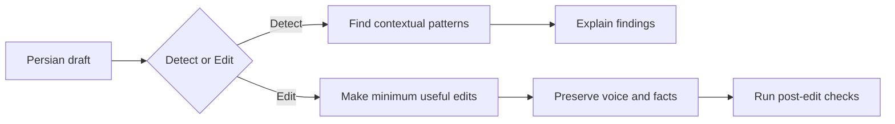

# Unslop FA

Detect and reduce formulaic AI-like patterns in Persian writing without flattening the writer's voice.

`unslop-fa` is an agent skill for Persian prose. It does **not** try to guess whether a text was written by AI. Instead, it looks for observable writing patterns that often make Persian text feel generated, over-polished, repetitive, translated, or generic.

## Problem

AI can produce clean Persian that still sounds strangely predictable.

Common examples include:

- «سؤال اصلی این نیست که X، بلکه این است که Y.»
- «در دنیای امروز...»
- «این فقط X نیست، بلکه Y است.»
- repeated `بنابراین` / `در نهایت` / `از این منظر` transitions;
- perfectly balanced arguments that read like a template;
- generic conclusions and quote-ready endings;
- marketing copy built from abstract benefits instead of concrete behavior;
- LinkedIn-style dramatic fragments and lesson stacks;
- translation-like Persian and unnecessary administrative phrasing;
- excessive use of the em dash (`—`) where normal Persian punctuation would read more naturally.

The opposite problem also matters: an editor can remove the writer's humor, bluntness, irregular rhythm, colloquial Persian, technical caveats, or deliberate repetition while trying to make the text "better."

Unslop FA is designed to avoid both failures.

## Install

The easiest way to install the skill is to paste this into Codex or another agent that can install skills from GitHub:

```text
Install the unslop-fa skill globally from https://github.com/ariyx/unslop-fa
```

You can also install it with a compatible skills CLI:

```bash
npx skills add ariyx/unslop-fa --skill unslop-fa --global --yes
```

Or copy [`skills/unslop-fa/`](skills/unslop-fa/) into the skills directory used by your agent.

No runtime, API key, or Python package is required to use the skill itself.

## Use

### Edit Persian writing

In Codex:

```text
$unslop-fa

متن شما...
```

Ask for a specific kind of edit when needed:

```text
$unslop-fa

این متن رو طبیعی‌تر کن، ولی لحن و اصطلاحات فنی من رو حفظ کن:

متن شما...
```

The skill makes the minimum useful edits, preserves the original meaning and voice, and briefly explains the main changes.

Agents that expose skills as slash commands may use `/unslop-fa` instead.

### Detect slop without rewriting

```text
$unslop-fa

این متن رو فقط بررسی کن و الگوهای AI-like رو بگو. بازنویسی نکن:

متن شما...
```

Detect mode names the relevant patterns, quotes the smallest useful passage, explains why the pattern is a problem **in that context**, and suggests a revision direction.

It does not assign an "AI probability" or claim to know who wrote the text.

## What it catches

Unslop FA currently covers core Persian patterns plus genre-specific patterns for analytical, argumentative, technical, social, and marketing writing.

Examples include:

1. **Semantic repetition** — repeating the same point in different wording without adding information.
2. **Unnecessary restatement** — explaining a sentence again immediately after saying it clearly.
3. **Canned transitions** — habitual connectors that make paragraph movement feel mechanical.
4. **Rhetorical reframing** — repeated forms such as «سؤال این نیست که... بلکه...».
5. **Artificial symmetry** — overly balanced X/Y structures that read like a template.
6. **Generic abstraction** — replacing concrete observations with broad claims about impact, value, or transformation.
7. **Over-hedging** — unnecessary repetition of «می‌تواند»، «ممکن است»، «احتمالاً» and similar qualifiers.
8. **Translation-like Persian** — structures that are grammatical but feel copied from English cadence.
9. **Administrative Persian** — needless phrases such as «لازم به ذکر است» or «نقش بسزایی ایفا می‌کند» when simpler Persian says the same thing.
10. **Em dash overuse** — repeated English-style use of `—` where `،`, `:`, parentheses, or a sentence break fits better.
11. **Social-media slop** — dramatic fragments, lesson stacks, manufactured revelations, and engagement-bait endings.
12. **Marketing slop** — triple-benefit headlines, abstract benefit language, universal-fit claims, and repeated value propositions.

Patterns are contextual. A word or structure is not automatically bad just because AI systems often use it.

## What it preserves

Unslop FA is intentionally conservative about good writing.

It protects:

- the writer's vocabulary, humor, bluntness, and cadence;
- colloquial and intentionally imperfect Persian;
- facts, dates, numbers, citations, and proper nouns;
- uncertainty and the original scope of claims;
- technical terminology and necessary repetition;
- quotations, interviews, pasted comments, correspondence, and other embedded voices;
- useful caveats in technical and analytical writing.

When a pattern could reasonably be part of the writer's voice, the default is to preserve it.

## How it works



The skill always loads the core Persian rules first, then applies genre-specific rules when the genre is clear.

For editing, it runs the checks in [`eval.md`](skills/unslop-fa/eval.md) before returning the result.

## What's inside

- [`SKILL.md`](skills/unslop-fa/SKILL.md) — behavior, modes, safeguards, and editing workflow.
- [`eval.md`](skills/unslop-fa/eval.md) — post-edit checks.
- [`rules/`](skills/unslop-fa/rules/) — core, Persian, analytical, argumentative, technical, social, and marketing rules.
- [`tests/fixtures/`](tests/fixtures/) — AI-like, human, and mixed regression cases.
- [`tests/expected/`](tests/expected/) — expected detect/edit behavior.
- [`tests/validate_cases.py`](tests/validate_cases.py) — structural test validator.

## Testing

The project is developed from regression cases rather than a blacklist of suspicious words.

```bash
python tests/validate_cases.py
```

The validator checks case integrity, rule IDs, expected outputs, and preservation constraints. It does not call an LLM and does not require an API key.

Human fixtures are especially important: they make sure new rules do not "fix" unusual but intentional human writing.

## Contributing

The most useful contribution is a real failure case.

If Unslop FA misses an obvious pattern or damages good Persian prose:

1. add a minimal reproducible fixture;
2. describe what should or should not change;
3. update the smallest relevant rule;
4. add or update the expected behavior;
5. run `python tests/validate_cases.py`.

Avoid phrase blacklists. A useful rule should describe **when** a pattern becomes a problem and **when it should be preserved**.

See [`CONTRIBUTING.md`](CONTRIBUTING.md) for details.

## License

MIT. See [`LICENSE`](LICENSE) and [`NOTICE.md`](NOTICE.md).