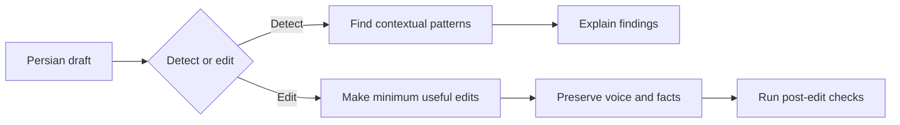

# Unslop FA

Unslop FA is an agent skill for detecting and editing formulaic AI-like patterns in Persian prose while preserving the writer's meaning, uncertainty, technical precision, and voice.

It does not determine whether a person or an AI wrote a text. It identifies observable patterns that can make Persian writing feel repetitive, generic, translated, over-polished, or mechanically structured, and it makes conservative edits only when the context supports them.

## What it does

The skill supports two modes:

- **Detect** — identify contextual patterns, quote the smallest useful passage, explain the problem, and suggest a revision direction without rewriting the draft.
- **Edit** — make the minimum effective changes, preserve facts and voice, and briefly summarize the main interventions.

The rule set covers general Persian prose and genre-specific checks for analytical, argumentative, technical, social, and marketing writing. It is deliberately conservative about colloquial language, humor, deliberate repetition, quotations, embedded voices, technical terminology, caveats, numbers, dates, citations, and uncertainty.

## Requirements

To use the skill:

- an agent that supports installing and invoking skills;
- Node.js and `npx` only if you use the Skills CLI installation method below.

To work on the repository or run its checks:

- Python 3. The validator uses only the standard library and does not call an LLM or require an API key.

There is no application runtime, package manager project, service, database, or environment-variable configuration in this repository.

## Installation

### Skills CLI

If Node.js is available, install the skill with a compatible Skills CLI:

```text
npx skills add ariyx/unslop-fa --skill unslop-fa --global --yes
```

### Agent-assisted installation

In Codex or another agent that can install skills from GitHub, ask it to install:

```text
Install the unslop-fa skill globally from https://github.com/ariyx/unslop-fa
```

### Manual installation

Copy [`skills/unslop-fa/`](skills/unslop-fa/) into the skills directory used by your agent. The directory must contain `SKILL.md`, `eval.md`, and the `rules/` files together.

The skill itself has no runtime dependencies, package dependencies, API keys, or required `.env` file.

## Usage

After installation, invoke the skill using the syntax supported by your agent. Codex users can use `$unslop-fa`; agents that expose skills as slash commands may use `/unslop-fa`.

### Edit Persian writing

```text
$unslop-fa

این متن را طبیعی‌تر کن، ولی لحن و اصطلاحات فنی من را حفظ کن:

[متن شما]
```

Ask for a narrower edit when appropriate, such as preserving a formal register or changing only a repetitive transition.

### Detect patterns without rewriting

```text
$unslop-fa

این متن را فقط بررسی کن و الگوهای AI-like را بگو. بازنویسی نکن:

[متن شما]
```

Detect mode reports only patterns that are present in context. It does not assign an AI score, estimate authorship, or rewrite the full draft.

## How the skill works

The skill loads the core and Persian rules first, then adds genre-specific rules when the genre is clear. In edit mode, it applies the checks in [`skills/unslop-fa/eval.md`](skills/unslop-fa/eval.md) before returning the result.



The rules are contextual rather than a blacklist. For example, a connector such as `بنابراین` or a technical term may be entirely appropriate once, but distracting when repeated mechanically.

## Repository layout

- [`skills/unslop-fa/SKILL.md`](skills/unslop-fa/SKILL.md) — modes, safeguards, rule-loading behavior, and editing workflow.
- [`skills/unslop-fa/eval.md`](skills/unslop-fa/eval.md) — post-edit evaluation checks.
- [`skills/unslop-fa/rules/`](skills/unslop-fa/rules/) — core, Persian, genre, and technical safeguards.
- [`tests/fixtures/`](tests/fixtures/) — AI-like, human, and mixed regression fixtures.
- [`tests/expected/`](tests/expected/) — expected findings, edits, and case metadata.
- [`tests/validate_cases.py`](tests/validate_cases.py) — dependency-free structural validator.
- [`CONTRIBUTING.md`](CONTRIBUTING.md) — guidance for rules, fixtures, and pull requests.

## Development and testing

Clone the repository, make changes to the skill or its regression corpus, and run:

```text
python tests/validate_cases.py
```

If your system exposes Python 3 as `python3` or `py`, use that command in place of `python`.

The validator checks that fixtures exist, case metadata is valid, referenced rule IDs exist, expected files are present, and preservation tokens survive expected edits. Human fixtures protect against over-editing distinctive but intentional Persian prose.

This repository currently has no formatter, linter, type checker, build script, package manifest, lockfile, or GitHub Actions workflow. The validation command above is the project’s available automated check.

## Contributing

The most useful contribution is a small, reproducible failure case. If the skill misses a pattern or damages good Persian prose:

1. add a minimal fixture;
2. describe what should and should not change;
3. update the smallest relevant rule;
4. add or update the expected behavior;
5. run the validator.

Avoid universal banned-word rules. A useful rule explains when a pattern becomes a problem and when it should be preserved. See [`CONTRIBUTING.md`](CONTRIBUTING.md) for the repository’s contribution guidance.

## License

Unslop FA is available under the MIT License. See [`LICENSE`](LICENSE) and [`NOTICE.md`](NOTICE.md) for licensing and attribution details.